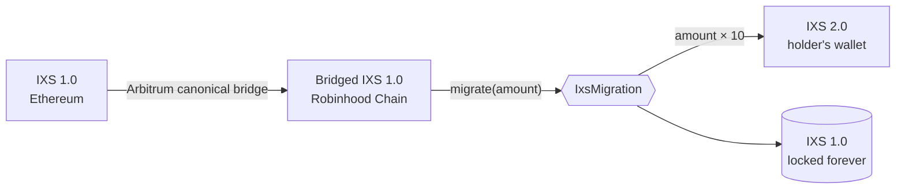

# IXS Contracts

Smart contract source for IXS, published for auditors, reviewers and integrators.

Tests and deployment scripts live in [IXS-Finance/ixs-vaults-uups](https://github.com/IXS-Finance/ixs-vaults-uups). That repository is private; access is available on request.

## `IxsToken`

[`contracts/IxsToken.sol`](contracts/IxsToken.sol): the IXS 2.0 ERC-20 token. **Not deployed yet.**

- 2.5B IXS are minted once, in the constructor, to `genesis`. No mint function exists.
- Holders can `burn` their own tokens, or `burnFrom` with an allowance.
- The owner (`Ownable2Step`) can only `pause`/`unpause`, which halts all transfers and burns. It cannot mint, move, seize or blacklist tokens.
- `renounceOwnership` is blocked while paused.
- Not upgradeable. No permit.

**Scope:** one file, 56 lines. It is built from stock OpenZeppelin v5.3.0 components (`ERC20`, `ERC20Burnable`, `ERC20Pausable`, `Ownable2Step`). The only custom logic is the `renounceOwnership` guard.

## `IxsMigration`

[`contracts/IxsMigration.sol`](contracts/IxsMigration.sol): a one-way swap from IXS 1.0 to IXS 2.0 on Robinhood Chain, at **1 IXS 1.0 → 10 IXS 2.0**. **Not deployed yet.**

How it works:
1. Bridge IXS 1.0 from Ethereum to Robinhood Chain over the [Arbitrum canonical bridge](https://portal.arbitrum.io/bridge?sourceChain=ethereum&destinationChain=robinhood-chain).
2. On Robinhood Chain, `approve` the migration contract, then call `migrate(amount)`.
3. In the same transaction, the contract takes `amount` IXS 1.0 and sends `amount × 10` IXS 2.0 to the caller.

Design:
- **Canonical IXS 1.0 only.** The accepted token is fixed at deployment. Any other token named "IXS" is never touched.
- **Exact and atomic.** 1 → 10 with no fees and no rounding. Both legs settle in one transaction or the whole transaction reverts. If the contract holds too little IXS 2.0, `migrate` reverts and the holder keeps their IXS 1.0.
- **Pays the caller.** IXS 2.0 always goes to the address that calls `migrate`. For a multisig or smart wallet, that is the multisig or wallet itself.
- **Pre-funded, never mints.** IXS funds the contract with IXS 2.0 by plain transfer.
- **Migrated IXS 1.0 is locked forever.** No function can move it. The only IXS 1.0 that can be swept is IXS 1.0 sent to the contract directly by mistake, meaning any balance above `totalMigrated`.
- **Owner (`Ownable2Step`)** can:
  - pause and unpause `migrate`;
  - sweep IXS 2.0 and stray tokens.

  It cannot move migrated IXS 1.0, change the ratio or the tokens, mint, or take tokens from holders. `renounceOwnership` is stock OpenZeppelin.
- **Not upgradeable.**

**Scope:** one file, 110 lines. It is built from stock OpenZeppelin v5.3.0 components (`Ownable2Step`, `Pausable`, `SafeERC20`).

### Canonical IXS

| Token / contract | Chain | Address |
|---|---|---|
| IXS 1.0 (canonical) | Ethereum (1) | [`0x73d7c860998CA3c01Ce8c808F5577d94d545d1b4`](https://etherscan.io/token/0x73d7c860998CA3c01Ce8c808F5577d94d545d1b4) |
| Arbitrum L1 ERC-20 gateway (bridge escrow) | Ethereum (1) | [`0x85001CC4867C5e1C22dA4B79BB8852B9e2a06da0`](https://etherscan.io/address/0x85001CC4867C5e1C22dA4B79BB8852B9e2a06da0) |
| IXS 1.0 (bridged, canonical) | Robinhood Chain (4663) | [`0x91d5d2C999C35ce061fD4967e6764Cdd9cF1b3e1`](https://robinhoodchain.blockscout.com/token/0x91d5d2C999C35ce061fD4967e6764Cdd9cF1b3e1) |
| Arbitrum L2 ERC-20 gateway | Robinhood Chain (4663) | [`0xfd9b17206278C16DdaacF6AC8f05dBf97EdCb31e`](https://robinhoodchain.blockscout.com/address/0xfd9b17206278C16DdaacF6AC8f05dBf97EdCb31e) |
| IXS 2.0 (`IxsToken`) | Robinhood Chain (4663) | Not deployed |
| `IxsMigration` | Robinhood Chain (4663) | Not deployed |

The bridged IXS 1.0 is the token that the Arbitrum gateway issues for canonical IXS. Anyone can check this on-chain:
- `l1Address()` on the bridged token returns the Ethereum IXS address;
- `calculateL2TokenAddress(0x73d7…d1b4)` on the L2 gateway returns the bridged token.

The bridged token's code is upgradeable by Robinhood Chain's bridge governance, as with every Arbitrum standard-bridged token. IXS cannot upgrade it.

## Contracts

| Contract | What it is | Upgradeable | Status |
|---|---|---|---|
| [`IxsToken`](contracts/IxsToken.sol) | IXS 2.0 ERC-20, fixed 2.5B supply | No | Not deployed |
| [`IxsMigration`](contracts/IxsMigration.sol) | IXS 1.0 → IXS 2.0 swap, 1:10, one-way | No | Not deployed |
| [`ERC7540OperatedVault`](contracts/ERC7540OperatedVault.sol) | ERC-4626 vault with async deposits and redemptions (ERC-7540) | UUPS | Live |
| [`ManagedVault`](contracts/ManagedVault.sol) | ERC-4626 vault with sync deposits and queued redemptions | UUPS | Live |

## Vault deployments

| Vault | Chain | Asset | Contract | Proxy | Implementation |
|---|---|---|---|---|---|
| IX High Yield Bond (USDC), permissionless | Avalanche (43114) | USDC | `ERC7540OperatedVault` | [`0xaD01573b459805E3954398796203d830B57A8bD9`](https://snowscan.xyz/address/0xaD01573b459805E3954398796203d830B57A8bD9) | [`0x648c66E8791B1Ea20f01db549b49dE7FBa3f2a53`](https://snowscan.xyz/address/0x648c66E8791B1Ea20f01db549b49dE7FBa3f2a53) ² |
| IX High Yield Bond (USDC), permissioned | Avalanche (43114) | USDC | `ERC7540OperatedVault` | [`0x864E9C192a724773C2bB8C1e84572996074F0B41`](https://snowscan.xyz/address/0x864E9C192a724773C2bB8C1e84572996074F0B41) | [`0x35F8C1ea3b3Be06E5626F057094E498338f7B821`](https://snowscan.xyz/address/0x35F8C1ea3b3Be06E5626F057094E498338f7B821) ² |
| IX High Yield Bond (USDG) | Robinhood Chain (4663) | USDG | `ERC7540OperatedVault` | [`0x4a8B74A9d246082b671540492222e89c9A866498`](https://robinhoodchain.blockscout.com/address/0x4a8B74A9d246082b671540492222e89c9A866498) | [`0xbBCa80A7116aE46b0F249D279Ef43F86274dc4F4`](https://robinhoodchain.blockscout.com/address/0xbBCa80A7116aE46b0F249D279Ef43F86274dc4F4) ² |
| ix7540v1 | Base (8453) | USDC | `ERC7540OperatedVault` | [`0x864E9C192a724773C2bB8C1e84572996074F0B41`](https://basescan.org/address/0x864E9C192a724773C2bB8C1e84572996074F0B41) | [`0x35F8C1ea3b3Be06E5626F057094E498338f7B821`](https://basescan.org/address/0x35F8C1ea3b3Be06E5626F057094E498338f7B821) ² |
| ixv1 | BNB Chain (56) | USDC (18 dec) | `ManagedVault` | [`0xc975a3EeF2e49F8eDdEf585340C43f15300fCB82`](https://bscscan.com/address/0xc975a3EeF2e49F8eDdEf585340C43f15300fCB82) | [`0x96D16f6A266fa90702aA3E579aB87F983cEe9FF0`](https://bscscan.com/address/0x96D16f6A266fa90702aA3E579aB87F983cEe9FF0) ¹ |

- Some addresses repeat across chains because the same deployer and nonce were used. Always pair an address with its chain.
- ¹ Deployed from an earlier revision of `ManagedVault`, so its bytecode does not match the source here.
- ² Deployed before `requestDepositWithReferral` was added, so their bytecode does not match the source here until upgraded.

## Vaults

Both vaults issue 18-decimal shares against an asset held off-chain by a custodian. Deposits are forwarded to `custody` immediately. Custody funds the vault before a redemption is finalized.

**`ERC7540OperatedVault`**
- Deposit: `requestDeposit`, then the operator calls `finalizeDepositRequest(id, executionPrice)` to mint shares, or `rejectDepositRequest` to refund.
- Referral: `requestDepositWithReferral(assets, controller, owner, referralCode)` is `requestDeposit` plus a nonzero `bytes32` introducer code, emitted in `DepositReferral(requestId, controller, referralCode)`. No storage, no on-chain validation. The standard `requestDeposit` is unchanged.
- Redeem: `requestRedeem` escrows shares, then the operator calls `finalizeRedeemRequest(id, executionPrice)` to pay out, or `rejectRedeemRequest` to return the shares.
- Settlement uses the execution price only. `setNAV` is a manual override and never prices a settlement.
- Fees: `subscribeFeeBps` (taken in shares) and `redeemFeeBps` (taken in assets).
- Requests are controller-only, with no operator delegation. It is a push model: `claimable*` views always return 0, and the sync ERC-4626 entry points are disabled.

**`ManagedVault`**
- Deposit: sync `deposit`/`mint` at `pricePerShare`. Blocked while paused or while NAV is stale (default 48h).
- Redeem: `requestRedeem`, then the operator calls `finalizeRedeem` (pays out at live NAV minus `feeBps`) or `rejectRedeem`. Sync `withdraw`/`redeem` revert.
- NAV is set by `setNAV`.

**Both**
- Every price update is bounded by `maxNavChangeBps` (default 50%).
- The optional whitelist gates deposits and requests only, never transfers.
- Pause blocks new deposits and requests, never finalization or rejection.
- `sweepTokenToCustody` cannot move the vault asset or vault shares.
- Fees are capped at 100% and round in the vault's favor.

**Roles**

| Role | Can |
|---|---|
| `DEFAULT_ADMIN_ROLE` | Upgrade; set custody, fees, fee recipient, minimums, NAV limits, name/symbol and the whitelist toggle; sweep; manage roles |
| `OPERATOR_ROLE` | Finalize/reject requests; manage the whitelist (max 200 per batch) |
| `NAV_MANAGER_ROLE` | `setNAV` |
| `PAUSER_ROLE` | `pause` / `unpause` |

**Trust assumptions:** users rely on the operator and custodian to execute trades, hold the underlying and fund redemptions. Custody solvency is not enforced on-chain. The admin can upgrade the contract and change parameters.

## Build

`solc 0.8.28`, optimizer 200 runs, `viaIR = true`, EVM `prague`. Dependencies: [OpenZeppelin Contracts](https://github.com/OpenZeppelin/openzeppelin-contracts/tree/v5.3.0) and [Contracts Upgradeable](https://github.com/OpenZeppelin/openzeppelin-contracts-upgradeable/tree/v5.3.0), both v5.3.0, with the standard `@openzeppelin/` remappings.

## Checksums

SHA-256 of each source file:

| File | SHA-256 |
|---|---|
| `contracts/IxsToken.sol` | `fc8bd060111f258522f9448aa2e43c846af65fe64b3c24e1aba00c2f3feedd7f` |
| `contracts/IxsMigration.sol` | `4755e3c8ed0bce16dce3e054a4c6ce03c57edb39c7389c2aa3d235dc5a04d9bf` |
| `contracts/ERC7540OperatedVault.sol` | `4f2576f516b93fb24ef4c684504448543ff8504be8c8e227dc550c642c7bd26c` |
| `contracts/ManagedVault.sol` | `b6961f341ea4ca7c97408ca9a4f0fd220a4ba28d3b77ae4fc6954b61d1e45f80` |

Verify with `shasum -a 256 contracts/*.sol`.

## Security

Report vulnerabilities to **security@ixs.finance**. Don't open public issues.

## License

MIT
